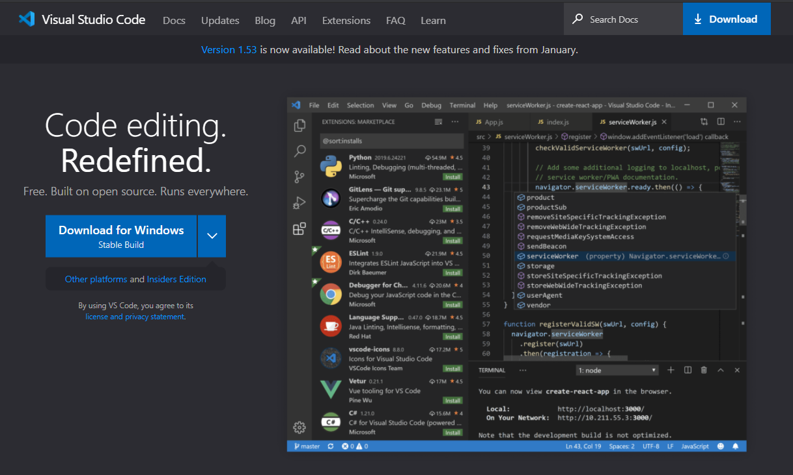
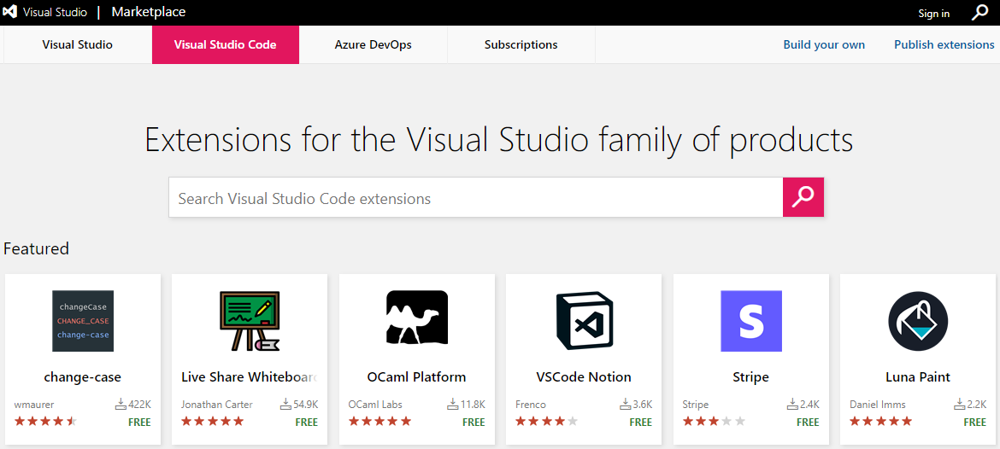
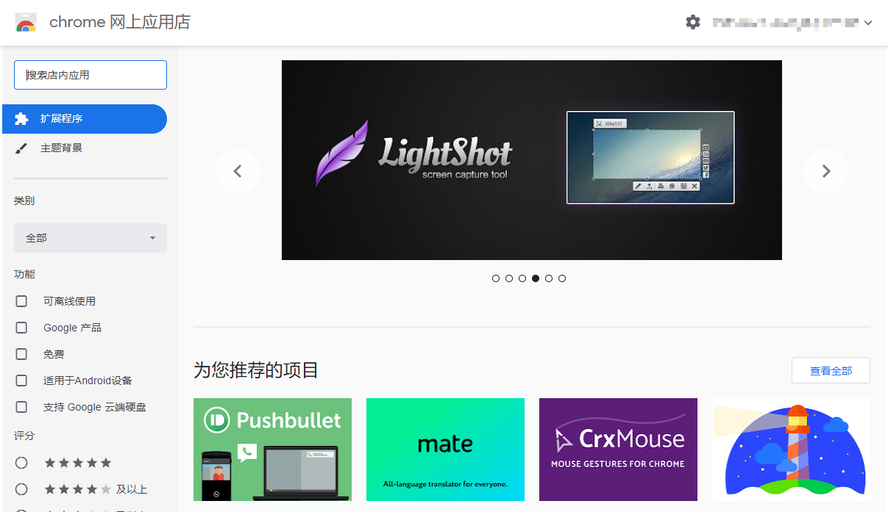
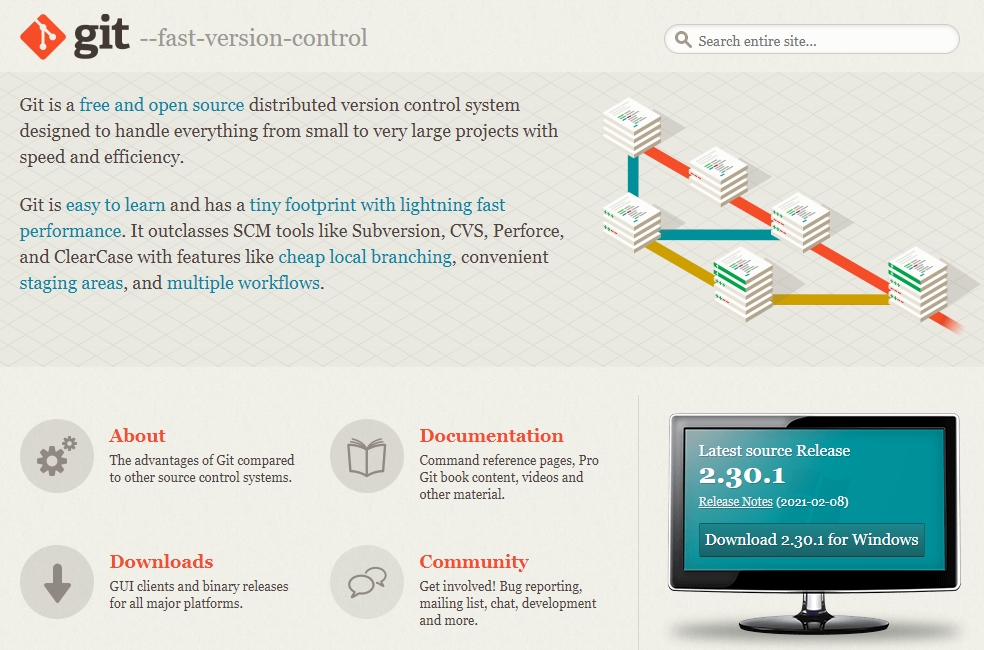
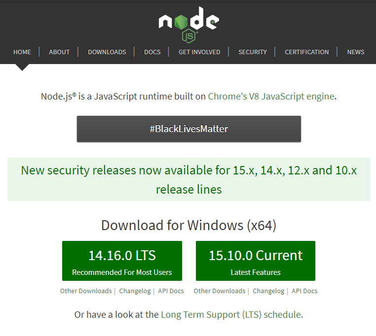
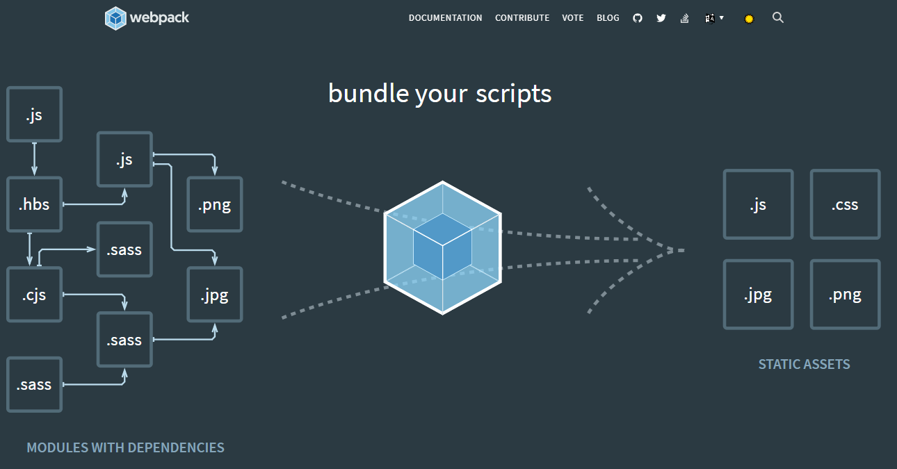

# 工具集推荐

## 前端开发工具链

工欲善其事必先利其器.上手的开发工具是我们刨析源码的利刃.我们需要熟练使用开发工具,对代码进行运行调试,逐步刨析代码的运行步骤,底层逻辑,当前状态等等.

### VS Code

VS Code 是这两年非常热门的一款开发工具，它不仅有提升开发体验的界面、轻量化的编辑器，还有丰富而强大的插件，这些优秀的插件使得 VS Code 生态体系更加吸引人，让开发效率大大提升。

[VS Code 下载](https://code.visualstudio.com/)
[VS Code 文档](https://code.visualstudio.com/docs)

### VS Code 插件

VS Code 的插件生态超级丰富,基本上可以满足我们所有的开需求.这里只推荐一些前端开发必备插件.

| 插件            | 名称 | 功能描述 |
| --------------- | ---- | -------- |
| View In Browser | 名称 | 功能描述 |

我们可以直接在 VS Code 编辑器中搜索下载,也可以到它的插件市场下载安装.

[VS Code 插件市场](https://marketplace.visualstudio.com/vscode)

### Chrome

浏览器是前端最核心的开发工具之一,其中的 `Chrome` 更是其中的佼佼者.不论是对各种 `HTML\CSS\JavaScript` 新属性的积极支持,还是 V8 引擎的开拓性影响都有着举足轻重的地位.可以说占据市场份额的半壁江山,也是实至名归的.

我日常开发的大部分页面布局样式\代码逻辑都是在`Chrome`上调试的,占据了我开发工具的几乎 50%的时间.这上面有着非常丰富的工具集,完全可以单独出一套教程进行深度学习.这里我推荐大家看一看老外写的官方文档.

[Chrome 下载](https://www.google.com/intl/zh-CN/chrome/)
[Chrome DevTools](https://developers.google.com/web/tools/chrome-devtools)

### Chrome 插件

Chrome 插件生态很丰富,这里我只推荐与前端开发相关的插件:`Vue.js devtools`(Vue 开发调试工具)和`React Developer Tools`(React 开发调试工具)

其他插件推荐请看这里
[Chrome 插件推荐](./chrome/plugin)

### Git

Git 是什么？ Git 是目前世界上最先进的分布式版本控制系统（没有之一）。

Git 有什么特点？简单来说就是：高端大气上档次！版本控制系统有很多,当这里只推荐 Git,因为它生态好,大家都在用.

[Git 下载](https://git-scm.com/downloads)
[Git 教程](http://git.oschina.net/progit/index.html?tdsourcetag=s_pcqq_aiomsg)

### Node.js

Node.js 是基于 Chrome JavaScript 运行时建立的一个平台，实际上它是对 Google Chrome V8 引擎进行了封装，它主要用于创建快速的、可扩展的网络应用。Node.js 采用事件驱动和非阻塞 I/O 模型，使其变得轻量和高效，非常适合构建运行在分布式设备的数据密集型的实时应用。这里我们主要用它来构建运行我们的项目,因此我们这里只需要学会安装运行,使用它的 npm 包管理工具即可.

[Node.js 下载](https://nodejs.org/zh-cn/)
[Node.js 教程](https://www.runoob.com/nodejs/nodejs-tutorial.html)

### 包管理工具

npm 是 Node.js 自带的包管理工具,我们一般用它管理前端开发过程中需要的开发组件和依赖.yarn 功能上与 npm 基本一致,是另一款流行的包管理工具

[NPM 文档](https://www.npmjs.cn/)
[Yarn 文档](https://yarn.bootcss.com/docs/)

### Webpack

本质上，webpack 是一个用于现代 JavaScript 应用程序的*静态模块打包工具*。当 webpack 处理应用程序时，它会在内部构建一个 依赖图(dependency graph)，此依赖图对应映射到项目所需的每个模块，并生成一个或多个 bundle。

我们对于 Webpack 的了解只需要学会它是如何配置的,熟悉每一个配置命令的含义即可,不需要深入了解.

[Webpack 文档](https://webpack.docschina.org/concepts/)

### Vite

Vite 的定位就是下一代前端构建工具,跟 Webpack 功能一样,但构建原理不同.虽然它是 Vue 作者尤雨溪开发的,但它也可以用于构建其他工程化前端项目,比如 React.

目前还没有成熟的文档出来,所以就直接看 Github 上的仓库吧;教程方面也没有特别丰富的教程,目前就先看看技术胖写的尝鲜版教程吧

[Vite 仓库](https://github.com/vitejs/vite)
[Vite 教程](https://jspang.com/detailed?id=66)
